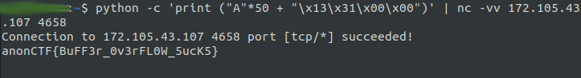

# Buffer Overflow

The code in the source file has a character buffer variable of size 50 bytes. The stack overflows after 50 bytes.  

There is a condition that checks if the variable 'modified' is equal to 0x3113. This means we should overflow the buffer variable in such a way that the value stored in modified variable should be changed to 0x3113.  

Due to little endianness 0x3113 is stored in memory as \x13\x31 
Using python one liner `python -c 'print("A" * 50 + "\x13\x31\x00\x00")' | ./vuln` we get the output 'redacted'  

Now using this payload we can get the flag.

  

