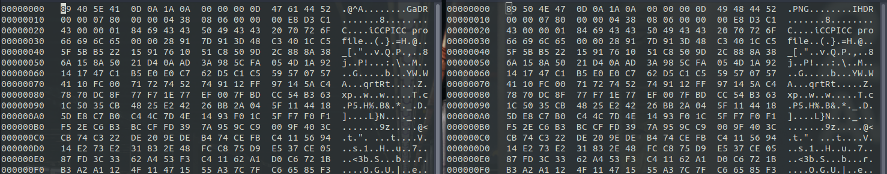

# Headers

The challenge name says 'headers'. 
The challenge file name is C0rrupt. Using `file` command in linux, the output is 'data'.  

This means the file is not identified. Checking the headers of the file suggests it's a png file. 
Comparing a png file with C0rrupt file and changing the headers accordingly using hexedit you can get a png image and the image contains the flag.  

__Wrong headers__&emsp;&emsp;&emsp;&emsp;&emsp;&emsp;&emsp;&emsp;&emsp;&emsp;&emsp;&emsp;&emsp;&emsp;&emsp;&emsp;&emsp;&emsp;&emsp;&emsp;&emsp;&emsp;&emsp;__Correct headers__

  

