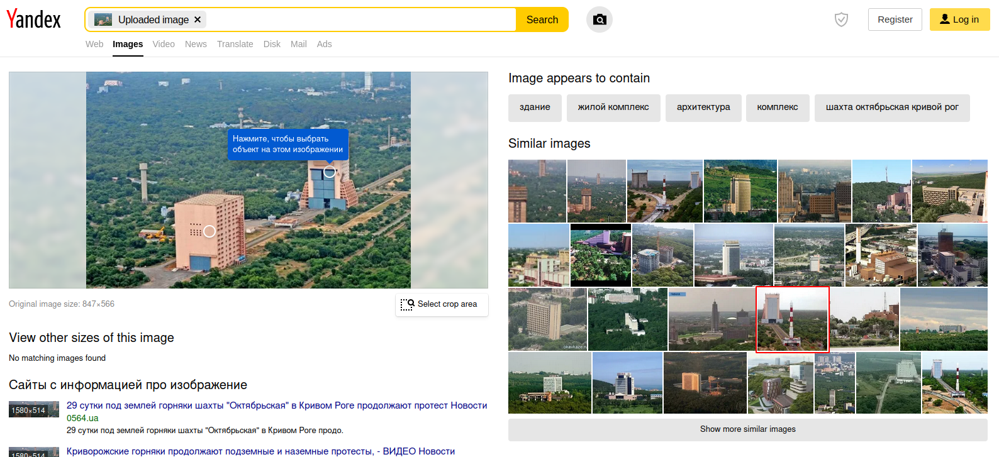
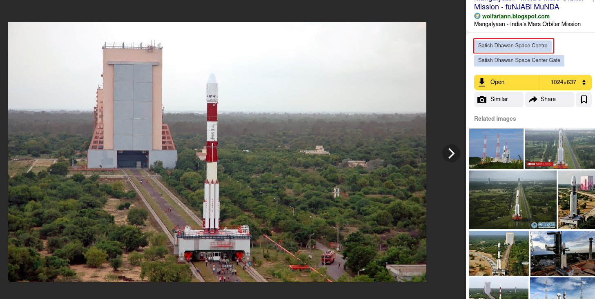
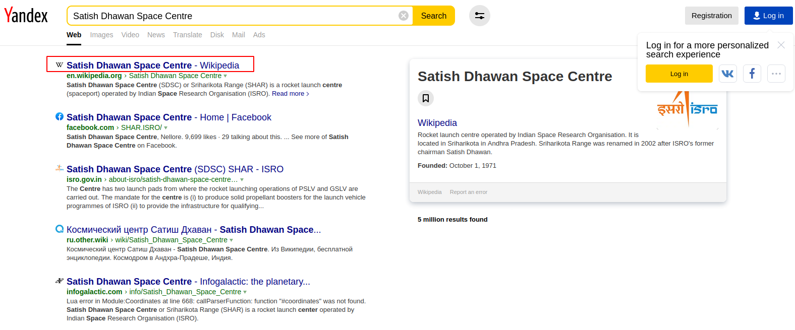
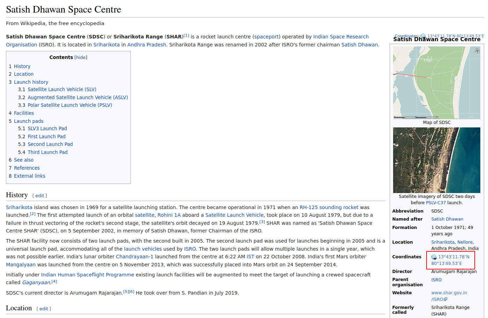

# OSINT 2

There is an image given to us along with this challenge. The challenge says to find the co-ordinates of this building.  

Reverse image search with [yandex images](https://yandex.com/images/)  

  

The marked image looks similar. Clicking on the image.

  

We get the name of this place. Searching this name.

  

We get the co-ordinates in the wikipedia entry of this place.

  

